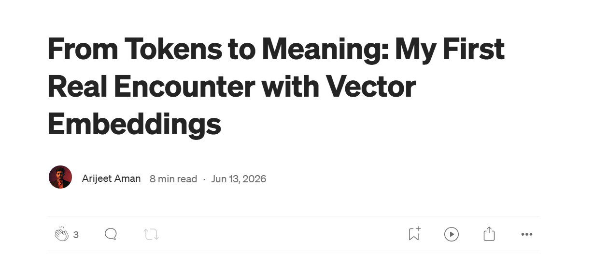
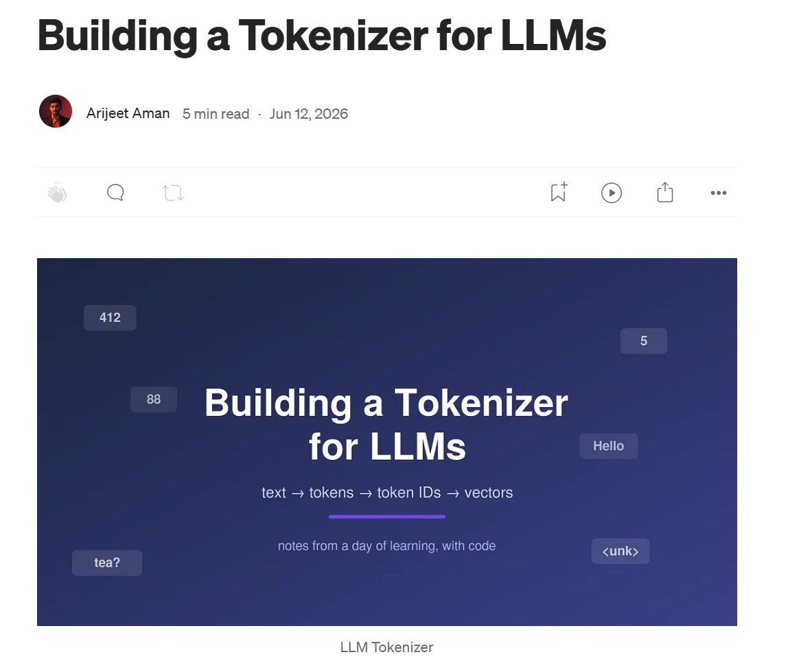

        
     
     
    

 <b>AI Engineer | Backend Developer | Building Production-Ready LLM Applications</b> 

 Hi, I'm Arijeet, a Computer Science graduate from India with a passion for building AI-powered applications and scalable backend systems. I specialize in LLMs, Retrieval-Augmented Generation (RAG), AI agents, and Python-based backend development. I'm continuously expanding my expertise in AI engineering by building production-ready projects and exploring the latest advancements in generative AI. 

<h2 align="center">📝 Featured Articles</h2>

<table align="center">
<tr>
<td align="center" width="50%">

  

<b>From Tokens to Meaning</b>

Understanding vector embeddings and semantic search for modern LLMs.

</td>

<td align="center" width="50%">

  

<b>Building a Tokenizer for LLMs</b>

Learn how BPE and tokenization work inside modern language models.

</td>
</tr>
</table>

 

  
  

---

Here are some ideas to get you started:

    
- 🔭 I'm currently building **Production-Ready AI Applications** using **LLMs, RAG, LangChain, LangGraph, and FastAPI**.
- 🌱 I'm currently learning **AI Agents, Agentic RAG, MCP, AI Evaluation, and Multi-Agent Systems**.
- 👯 I'm looking to collaborate on **AI Engineering, LLM, RAG, and Open Source Projects**.
- 🤝 I'm always open to discussing **LLMs, Agentic AI, and Production AI Systems**.
- 💬 Ask me about **Python, FastAPI, LangChain, LangGraph, LLMs, RAG, AI Agents, and Machine Learning**.

- 📫 How to reach me: [Linkedin](https://www.linkedin.com/in/arijeet-aman/)
 
 
 ---
 
 ## ⚡ Technologies

  
  
  
  
    <!-- AI & LLM -->       <!-- ML -->     <!-- Backend -->   <!-- Vector DB -->   <!-- Database -->   <!-- Tools -->   

---

## Let's Connect

I'm always open to collaborating on AI Engineering, LLM, RAG, and Backend projects.

If you'd like to work together or simply chat about AI, feel free to reach out through LinkedIn, X, or Medium.

Thanks for visiting my profile!

<h3 align="center">🤖 End of README...</h3>

You reached the end. 
The AI has no more tokens to generate.

